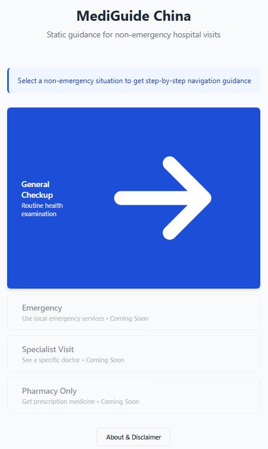
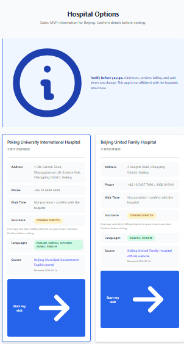

# MediGuide China

MediGuide China is a static navigation prototype for English-speaking visitors preparing for non-emergency hospital visits in China. It provides step-by-step hospital navigation guidance, public contact information, and bilingual phrases for common administrative situations.

**Important:** This is not medical advice, diagnosis, triage, insurance verification, or emergency support. For possible emergencies, contact local emergency services immediately.




## Features

### Current Features (MVP v1.0.0)

- **Situation Selection**: Choose from different visit types (General Checkup, Emergency, Specialist Visit, Pharmacy)
- **City-Based Options**: Static hospital information for Beijing
- **Insurance Prompt**: Reminds users to confirm billing and coverage directly
- **Visit Progress Tracking**: Step-by-step guidance through the hospital visit process
- **Bilingual Support**: English and Chinese phrases for common situations
- **Disclaimer Modal**: Clear communication about the app's limitations and purpose

### Coming Soon

- More non-emergency visit guidance
- Specialist visit navigation
- Pharmacy-only visits
- Additional cities support

## Tech Stack

- **Frontend Framework**: React 19.2.0
- **Routing**: React Router DOM 7.13.0
- **Build Tool**: Vite 7.2.4
- **Language**: JavaScript (JSX)
- **Styling**: CSS with custom properties

## Project Structure

```
mediguide-china/
├── src/
│   ├── components/
│   │   ├── DisclaimerModal.jsx    # Initial disclaimer modal
│   │   └── Icons.jsx               # Reusable icon components
│   ├── pages/
│   │   ├── Home.jsx                # Landing page with situation selection
│   │   ├── CitySelection.jsx      # City and insurance selection
│   │   ├── HospitalRecommendation.jsx  # Hospital list and details
│   │   ├── VisitProgress.jsx      # Step-by-step visit guidance
│   │   ├── StepDetail.jsx         # Detailed step information
│   │   ├── Placeholder.jsx        # Coming soon pages
│   │   └── About.jsx               # About and disclaimer page
│   ├── App.jsx                     # Main app component with routing
│   └── main.jsx                    # Application entry point
├── index.html
├── package.json
└── vite.config.js
```

## Installation

### Prerequisites

- Node.js (v16 or higher recommended)
- npm or yarn

### Setup

1. Clone the repository:

```bash
git clone <repository-url>
cd MediGuide-China/mediguide-china
```

2. Install dependencies:

```bash
npm install
```

## Usage

### Development

Start the development server:

```bash
npm run dev
```

The application will be available at `http://localhost:5173` (or another port if 5173 is in use).

### Build

Create a production build:

```bash
npm run build
```

The built files will be in the `dist/` directory.

### Preview

Preview the production build locally:

```bash
npm run preview
```

### Lint

Run ESLint to check code quality:

```bash
npm run lint
```

## User Flow

1. **Disclaimer**: Users must accept the disclaimer before accessing the app
2. **Home**: Select the type of visit (currently only "General Checkup" is active)
3. **City Selection**: Choose your city (currently Beijing only)
4. **Insurance Question**: Indicate if you have international health insurance
5. **Hospital Options**: View static hospital options with source links and verification reminders
6. **Visit Progress**: Follow step-by-step guidance through the hospital visit
7. **Step Details**: Access detailed information for each step

## Key Components

### DisclaimerModal

- Displays important legal and medical disclaimers
- Must be accepted before accessing the app
- Ensures users understand the app's limitations

### Home

- Main landing page
- Situation selection (General Checkup, Emergency, Specialist, Pharmacy)
- Currently only General Checkup is enabled

### CitySelection

- Two-step questionnaire
- City selection (Beijing)
- Insurance status (Yes/No)
- Progress indicator for user feedback

### HospitalRecommendation

- Displays static hospital options based on city selection
- Hospital details, source links, and contact information
- Navigation to visit progress

### VisitProgress

- Step-by-step guidance through hospital visit
- Progress tracking
- Links to detailed step information

## Compliance Notes

- License: MIT, see [LICENSE](LICENSE).
- Third-party notices: see [THIRD_PARTY_NOTICES.md](THIRD_PARTY_NOTICES.md).
- Privacy notice: see [PRIVACY.md](PRIVACY.md).
- Data sources and medical scope: see [DATA_SOURCES.md](DATA_SOURCES.md).

## Important Disclaimers

This application:

- Does NOT provide medical advice, diagnosis, or treatment recommendations
- Does NOT replace professional medical consultation
- Does NOT guarantee hospital availability, services, or wait times
- Does NOT verify insurance coverage or payment information
- Does NOT offer emergency medical services
- Is NOT affiliated with the hospitals listed in the app

**Always consult qualified healthcare professionals for all medical decisions.**

## Development Notes

- The app uses React Router for client-side routing
- Custom CSS properties are used for theming
- Icons are implemented as React components for flexibility
- The app is designed mobile-first with responsive layouts

## Contributing

Contributions are welcome! Please ensure:

- Code follows the existing style and conventions
- All new features include appropriate error handling
- Medical disclaimers remain prominent and clear
- Accessibility standards are maintained

## License

This project is licensed under the MIT License - see the [LICENSE](LICENSE) file for details.

## Important Medical Disclaimer

**Critical legal notice:**

MediGuide China is a navigation and information tool only. It is **NOT**:

- Medical advice
- A substitute for professional medical consultation
- A diagnosis or treatment recommendation tool
- A guarantee of hospital services or availability
- An official or affiliated hospital service

**Always consult qualified healthcare professionals for all medical decisions.**

Users assume responsibility for verifying information before relying on it. Contributors and maintainers are not liable for medical outcomes, misuse, or damages resulting from use of this application.

## Contact & Support

For questions, feedback, or to report issues, please open an issue on GitHub.

## Version History

- **v1.0.0** (MVP): Initial release with basic navigation features for Beijing general checkups
